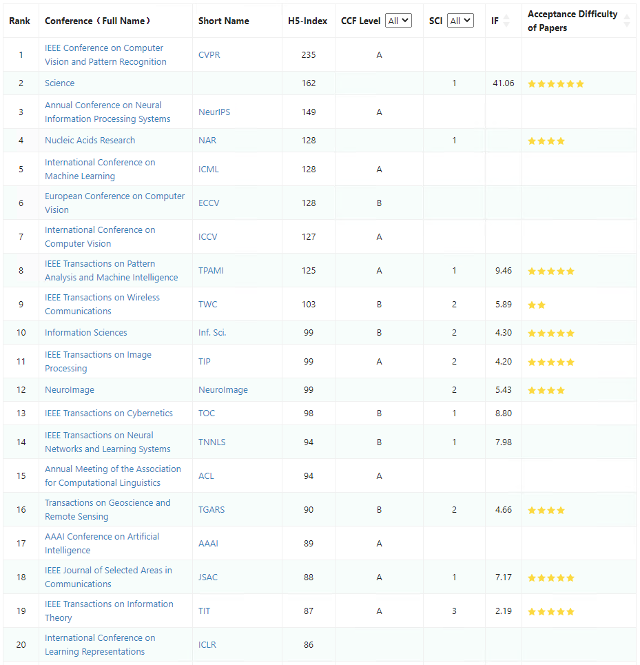

# 计算机科学部分顶会

\*\*\*\*[**顶会review paper内容查看**](https://openreview.net/)\*\*\*\*

**AAAI** 美国人工智能年会（AAAI Conference on Artificial Intelligence），简称 AAAI，是人工智能领域的顶级国际会议。该会议固定在每年的 2 月份举行，由 AAAI 协会主办。

**ICLR** 国际学习表征会议（International Conference on Learning Representations），简称 ICLR，2013 年成立了第一届，由位列深度学习三大巨头之二的 Yoshua Bengio 和 Yann LeCun 牵头创办。

**ICML** 国际机器学习大会 International Conference on Machine Learning 的缩写。ICML 如今已发展为由国际机器学习学会（IMLS）主办的年度机器学习国际顶级会议。

**CVPR** 是 IEEE Conference on Computer Vision and Pattern Recognition 的缩写，即 IEEE 国际计算机视觉与模式识别会议。该会议是由 IEEE 举办的计算机视觉和模式识别领域的顶级会议。

**MICCAI** 是由国际医学图像计算和计算机辅助干预协会\(Medical Image Computing and Computer Assisted Intervention Society\) 举办，跨医学影像计算\(MIC\)和计算机辅助介入 \(CAI\) 两个领域的综合性学术会议，是该领域的顶级会议。

**ACL** 国际计算语言学协会 \(ACL，The Association for Computational Linguistics\) 是自然语言处理和计算机语言学最顶尖的会议之一，其会员遍布世界各地，被 CCF（中国计算机学会）认定为 A 类国际学术会议，涵盖领域包括语言分析、信息抽取、机器翻译与自动问答等。

**IJCAI** 人工智能国际联合大会（International Joint Conference on Artificial Intelligence）是国际人工智能领域排名第一的学术会议，为 CCF A 类会议。该会议起于 1969 年每两年举办一次，自 2016 年起每年举办一次。

**ICDM** 全称为 IEEE International Conference on Data Mining，为数据挖掘顶会，首次举办于2001年，至今已经举办了第 19届会议。

**KDD** 全称是 Knowledge Discovery and Data Mining，即知识发现与数据挖掘，由美国计算机协会 ACM 下的数据挖掘分会举办，是国际数据挖掘领域的顶级会议。

**ECCV** 全称为 European Conference on Computer Vision（欧洲计算机视觉会议），与 CVPR、ICCV 共称为计算机视觉领域三大顶级学术会议，每两年召开一次。

**NeurIPS** 为神经信息处理系统大会，前称NIPS，是一个机器学习和计算神经科学相关的学术会议，每年12月举行。1986年由[加利福尼亚理工学院](https://zh.wikipedia.org/wiki/%E5%8A%A0%E5%88%A9%E7%A6%8F%E5%B0%BC%E4%BA%9A%E7%90%86%E5%B7%A5%E5%AD%A6%E9%99%A2)和[贝尔实验室](https://zh.wikipedia.org/wiki/%E8%B4%9D%E5%B0%94%E5%AE%9E%E9%AA%8C%E5%AE%A4)的学者提出，1987年首次举办。2000年前举办地均在美国[丹佛](https://zh.wikipedia.org/wiki/%E4%B8%B9%E4%BD%9B)，此后曾在美国、西班牙、加拿大多地举办。2017年参会人数约为8000人。

[计算机科学顶会排行](https://www.aminer.cn/ranks/conf)

**References:**

1. [最新！AI顶会排行榜揭晓， CVPR居首 NIPS、ICML分列二、三位](https://zhuanlan.zhihu.com/p/82288889)
2. [神经信息处理系统大会](https://zh.wikipedia.org/wiki/%E7%A5%9E%E7%BB%8F%E4%BF%A1%E6%81%AF%E5%A4%84%E7%90%86%E7%B3%BB%E7%BB%9F%E5%A4%A7%E4%BC%9A)
3. [2019 年，你参加了哪些 AI 学术顶会？](https://zhuanlan.zhihu.com/p/100234471)
4. [MICCAI](https://baike.baidu.com/item/MICCAI/23821008)

