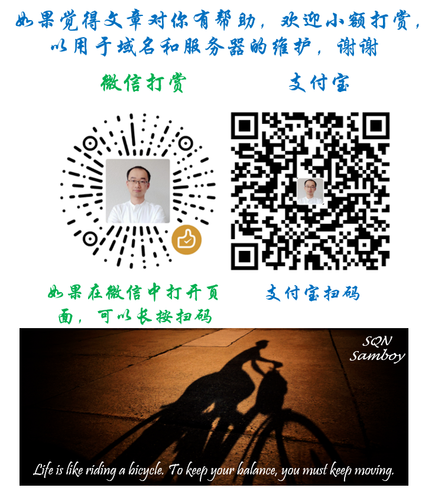

# 应该养成的良好工作习惯

### 文件夹

1. 定期清理电脑里的文件夹并适当进行合并和归类；
2. 定期对实体文件夹和文件进行清理和分类；
3. 避免在桌面、C盘“我的文档”“我的图片”等地方保存数据，可以在数据硬盘（如D盘E盘等）建立“Workspace”等文件夹进行日常临时存储和操作，避免在重装系统时C盘格式化造成的数据丢失；
4. 将浏览器（Chrome、Edge、IE等）的下载（download）目标文件夹设置为除系统盘（如C盘）之外的数据硬盘（如D盘E盘等），原因同上；
5. 将百度网盘、onedrive、googledrive、dropbox等云存储器的文件夹放置在数据盘（如D盘），原因同上；
6. 将微信、skype、viber等的聊天软件的传输数据的存储文件夹设置到数据盘（如D盘），原因同上；
7. 将虾米音乐等带有下载或者存储功能的软件的下载目录设置在数据盘（如D盘），原因同上；
8. 对于一些不需要修改注册表的小程序、或者绿色免安装的程序，尽量放置在数据盘（如D盘）中自己手动建立的“Program Files”文件夹，这样在系统重装后不影响这部分软件的正常使用；

### 文件

1. 新建office文件（word、excel、ppt）或其他工作文件后，如果不是仅仅为了短暂的使用，新建后及时手动保存并选择合理的存储位置和文件名称；
2. 对office软件（word、excel、ppt）设置自动保存功能，根据自己的偏好设置成每隔1分钟到30分钟的自动保存。这样一旦出现断电、电脑故障等问题，也有希望尽可能恢复最近的工作；
3. 若已经进行了上述设置，出现问题不用慌，一般重新打开word等软件后会自动提示恢复未保存的文件。如果没有提示，可以在网上搜索一下怎么找到temp文件或者手动恢复，比如这篇[《Office自己保存的临时文件在什么位置》](https://zhidao.baidu.com/question/220923204.html)
4. 养成定时手动ctrl+s保存的习惯；
5. 对于不需要的文件，可以删除到回收站。如果不是很确定是否还需要，可以先放到D盘中手动建的文件夹“TempToDelete”中暂存，过一段时间后再删除；
6. 对于要修改后保存为新版本的文件，建议先复制原文件（如XXX\_v1）并重新命名（如XXX\_v2），然后在新的文件中进行修改。避免直接打开原来的本来修改后再“另存为”，因为这样很容易由于在编辑中习惯性地进行保存，或者由于系统自动保存，导致该版本不再是最初的版本。
7. 如果希望知道自己对哪些内容进行了修改，对于word文件，可以使用“审阅”中的“追踪修改”的功能。该功能尤其在多人协作修改某文件时可以知道大家分别修改了哪些内容。最后依次接受或者拒绝修改的内容并调整页面布局即可。

### 更换工作电脑时的原电脑清理工作

文件夹的设立基本按照上述原则，所以除了部分软件外，大部分在数据盘自己建立的各类文件夹中。以下位置仅供参考，请根据实际情况对标自己的文件夹，同时部分位置可以举一反三扩展至相似文件夹：

#### D盘中的文件

1. D:\DesktopWorkspace 
2. D:\TEMP\_CouldDelete 
3. D:\Downloads
4. D:\VirtualBoxVMs
5. D:\ChatFiles 
6. D:\Onedrive
7. D:\Google Drive
8. D:\Dropbox \(Personal\)

#### C盘的部分临时文件（用户名换成你自己的）

1. C:\Users\qingn   \(check the sub-folders and files\)
2. C:\Users\qingn\Pictures
3. C:\Users\qingn\Documents
4. C:\Users\qingn\Documents\temp 
5. C:\Users\qingn\Documents\ViberDownloads
6. C:\Users\qingn\Downloads\Microsoft.SkypeApp\_kzf8qxf38zg5c!App\All 
7. （以下为隐藏文件夹，需先激活可以显示隐藏文件）
8. C:\Users\qingn\AppData\Local\Temp
9. C:\Users\qingn\AppData\Local\Microsoft\Office\UnsavedFiles
10. C:\Users\qingn\AppData\Local\Microsoft\Outlook\RoamCache
11. C:\Users\qingn\AppData\Roaming

#### 退出登录或清空浏览器信息

1. 退出各类办公软件如office、skype、wechat、zoom等，必要时进行备份和清理
2. 退出Chrome并清空cache、历史记录、收藏夹、自动填充、密码等
3. 退出Edge并清空cache、历史记录、收藏夹、自动填充、密码等
4. 退出IE并清空cache、历史记录、收藏夹、自动填充、密码等
5. Gmails \(Chrome、Edge\)
6. 退出工作和学生邮件
7. Onedrive 
8. Googledrive 
9. Potato Todo 并卸载
10. Outlook导出为Outlook文件并拷贝存档
11. 退出Outlook、系统自带的Mail程序

### 程序员的良好工作习惯

1. 使用版本工具管理代码，如git
2. 对不同项目使用对应的虚拟环境，可以自建虚拟环境，也可以用Anaconda建立和管理，更加方便
3. 把整个工作变成作为文档撰写的一部分：
   1. 及时撰写和更新README文件
   2. 文件和文件夹有规律的进行分类保存
   3. 定期汇总和更新电脑中文件夹的组织结构，目前发现Xmind做这个工作不错，并可以导出图片和markdown格式的文本，然后对应补充文件夹说明介绍
   4. 定期撰写工作汇报，即便没有外部的硬性要求。汇总和总结也便于之后自己查阅和比对之前的工作进度、成果等
4. 使用时间管理和项目管理工具，如甘特图、番茄钟、柳比歇夫时间管理法、GTD（Getting Things Done）方法，并配合相应的软件或app
5. 做好数据和代码的备份工作以及保密工作
6. 遵循代码的编写规范并定期回顾总结代码
7. 提供“干净”的代码以及对应的requirements.txt文件

